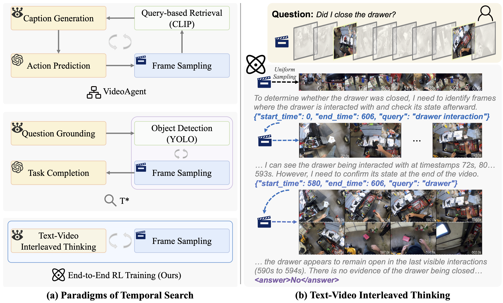
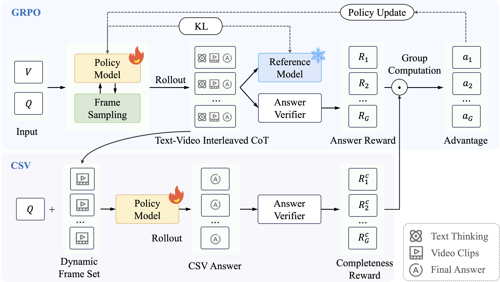

# ⏱️ TimeSearch-R: Adaptive Temporal Search for Long-Form Video Understanding via Self-Verification Reinforcement Learning

*A model that learns to actively search for relevant temporal clips through end-to-end reinforcement learning.*

[📄 [Paper](https://arxiv.org/abs/2511.05489)] [🤗 [Model](https://huggingface.co/Time-Search/TimeSearch-R)]

## 📰 News

🔥 **[2025/11/13]** Our [Model Checkpoint](https://huggingface.co/Time-Search/TimeSearch-R) is uploaded!

## 👁️ Overview

TimeSearch-R reformulates temporal search as interleaved text–video thinking, seamlessly integrating searching video clips into the reasoning process through reinforcement learning (RL).



We introduce GRPO with Completeness Self-Verification (GRPO-CSV), which gathers searched video frames from the interleaved reasoning process and utilizes the same policy model to verify the adequacy of searched frames, thereby improving the completeness of video reasoning.



## 🚀 Quick Start

### 🏝️ Environmental Setup

**Step 1:** Prepare the running environment.

Prepare the environment with CUDA and PyTorch (CUDA 12.4 and PyTorch 2.6.0 in our experiments), and install the dependencies with `pip`.

```bash
pip install -r requirements.txt
```

**Step 2:** Run the clip server for video frame retrieval.

Download the pre-trained SigLIP model.
```bash
huggingface-cli download google/siglip-so400m-patch14-384 --local-dir /path/to/your/local/filedir
```
Modify the `clip_as_service/server/clip_server/torch-flow.yml` to use the downloaded local model path and run the SigLIP server.

```bash
cd clip_as_service/server && pip3 install .

export CUDA_VISIBLE_DEVICES=RR
export GRPC_VERBOSITY=debug
export HF_HUB_OFFLINE=1
export PYTHONPATH=$PYTHONPATH:.

python3 -m clip_server
```

### 📦️ Dataset & Model

We provide the preprocessed JSON files for [Haystack-LVBench](https://huggingface.co/datasets/MLL-Lab/LongVideoHaystack). The corresponding `.mp4` video files can be downloaded from the original [LongVideoBench](https://huggingface.co/datasets/longvideobench/LongVideoBench) dataset.

Download the pre-trained TimeSearch-R model.

```bash
huggingface-cli download --resume-download Time-Search/TimeSearch-R --local-dir /path/to/your/local/filedir
```

**(Recommended) Prepare the frame cache and feature cache.**
To accelerate the inference and training speed, we recommend extracting the frames and features for the videos in advance.

```bash
python3 scripts/converts/prepare_frame_cache.py /path/to/your/local/data_root /path/to/your/local/haystack_lvbench_input.jsonl --num_workers 16 --target_fps 2
python3 scripts/converts/prepare_feature_cache.py /path/to/your/local/data_root /path/to/your/local/haystack_lvbench_input.jsonl --num_workers 16
```

### 📋️ Inference & Evaluation

**Step 1:** Run the TimeSearch-R inference.

```bash
# The IP address from the above step
export SIGLIP_URL=grpc://127.0.0.1:51000

torchrun \
    --nproc_per_node=8 \
    --master_port=24137 \
    time_r1/inference.py \
    --input_path /path/to/your/local/haystack_lvbench_input.jsonl \
    --save_path /path/to/your/local/haystack_lvbench_output \
    --data_root /path/to/your/local/data_root \
    --model_base /path/to/your/local/checkpoint \
    --prompt_template v4 \
    --use_env True \
    --use_vllm True \
    --batch_size 1 \
    --num_data_workers 2 \
    --total_video_tokens 24000 \
    --max_frames 768 \
    --max_tokens 256
```

**Step 2:** Evaluate the temporal search and QA performance.

The temporal search evaluation script is modified from [T*](https://github.com/mll-lab-nu/TStar).

```bash
# Temporal search evaluation
python time_r1/eval/eval_temporal_search.py --search_result_path /path/to/your/local/haystack_lvbench_output.jsonl

# QA evaluation
python time_r1/eval/longvideobench_eval.py /path/to/your/local/haystack_lvbench_output.jsonl
```

### 🏗️ GRPO-CSV Training

**Step 1:** Prepare the reward model.

We use [Qwen-2.5-72B-Instruct](https://huggingface.co/Qwen/Qwen2.5-72B-Instruct) as our reward model for LLM-as-a-judge verification.

```bash
# download Qwen-2.5-72B-Instruct model
huggingface-cli download --resume-download https://huggingface.co/Qwen/Qwen2.5-72B-Instruct --local-dir /path/to/your/local/filedir
```

Start a VLLM server of [Qwen-2.5-72B-Instruct](https://huggingface.co/Qwen/Qwen2.5-72B-Instruct) for LLM-as-a-judge verification.

```bash
vllm serve /path/to/your/local/filedir \
    --port 18901 \
    --gpu-memory-utilization 0.8 \
    --max-model-len 32768 \
    --tensor-parallel-size 8 \ 
    --served-model-name "judge" \
    --trust-remote-code \
    --disable-log-requests
```

**Step 2:** Train TimeSearch-R with GRPO-CSV.

We recommend using no less than 16 GPUs (2 nodes x 8 GPUs) for 7B training. For each node, we recommend using no less than 1024GB CPU RAM, as the long-form videos in training datasets can consume a large amount of memory.

We provide the training script for TimeSearch-R with GRPO-CSV in `scripts/train.sh`.

```bash
bash scripts/train.sh
```

## 🔖 Citation

If you find TimeSearch-R useful for your research and applications, please cite using this BibTeX:
```bibtex
@article{timesearch-r,
  title={TimeSearch-R: Adaptive Temporal Search for Long-Form Video Understanding via Self-Verification Reinforcement Learning},
  author={Pan, Junwen and Zhang, Qizhe and Zhang, Rui and Lu, Ming and Wan, Xin and Zhang, Yuan and Liu, Chang and She, Qi},
  journal={arXiv preprint arXiv:2511.05489},
  year={2025}
}
```

## 🎟️ License

This project is released under the [Apache 2.0 license](LICENSE).

## 🏅 Acknowledgements

We thank the authors of the following projects for their contributions:
*   [Qwen2.5-VL](https://github.com/QwenLM/Qwen2.5-VL)
*   [R1-V](https://github.com/Deep-Agent/R1-V)
*   [trl](https://github.com/huggingface/trl)
*   [T*](https://github.com/mll-lab-nu/TStar)
